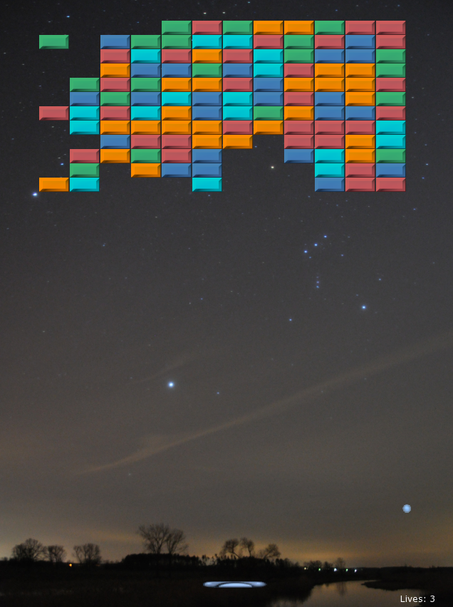

  

# Arkanoid

The classical Arkanoid game written in Modern C++ using [Simple and Fast Multimedia Library (SFML)](https://www.sfml-dev.org/).

## Features
- Paddle and ball mechanics
- Brick grid with collisions
- Keyboard and mouse control
- Modular project structure

## Build
- Visual Studio 2022
- C++17
- SFML
