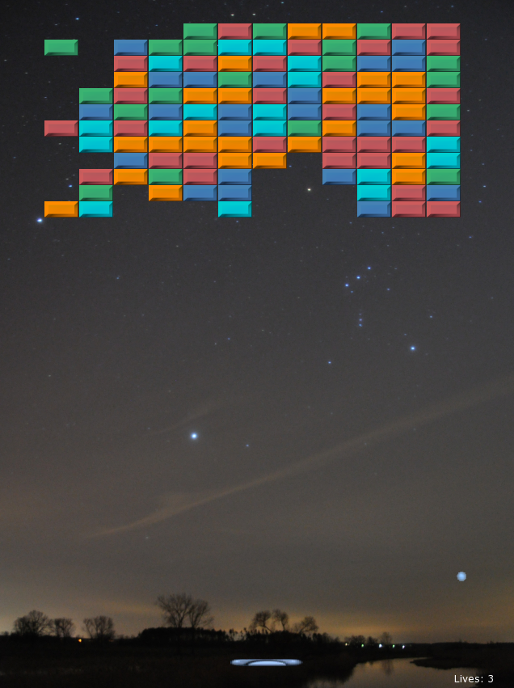

  

# 🎮 Arkanoid: Reclaiming the Solar System

**Classic block-breaking action meets a sci-fi story.** A full-featured Arkanoid game built in **Modern C++** with [SFML](https://www.sfml-dev.org/), featuring a unique narrative, 9 hand-crafted levels, power-ups, and a striking visual style.

---

## 🚀 Download & play

**[⬇️ Download the Windows installer (latest release)](https://github.com/YOUR_USERNAME/Arkanoid/releases/latest)**

*Replace `YOUR_USERNAME` with your GitHub username, or use a direct link to your installer (e.g. from Releases or a file host).*

---

## ✨ Why this project?

- **Portfolio-ready:** Clean C++17, entity-component style design, and SFML for graphics and audio.
- **Fully playable:** Start screen, level select (1–9), win/lose states, pause, reset, and fullscreen.
- **Rich gameplay:** Power-ups, multiball, ballstorm, plasma/antimatter balls, paddle size and ball speed modifiers.
- **Distinct look:** Thematic backgrounds and a cohesive “reclaim the solar system” vibe.

---

## 🎯 Highlights

| Feature | Description |
|--------|-------------|
| **9 levels** | Choose your first target (1–9), clear levels in any order, track progress. |
| **Power-ups & bonuses** | Multiball, Ballstorm, faster/slower ball, wider/narrower paddle, plasma ball, antimatter ball, extra life. |
| **Physics** | Substeps for ball movement to avoid tunneling; solid ball–brick, ball–paddle, and ball–wall collisions. |
| **Audio** | Sound effects for hits, power-ups, game over, victory, and an intro track. |
| **Controls** | Keyboard (arrows, Space, P, R, Escape) and mouse for paddle. |
| **Fullscreen** | Runs fullscreen by default with correct aspect ratio (letterboxing on resize). |

---

## 📖 The story (Year 3056)

AI-created cosmic structures have invaded the solar system. Planet after planet has fallen; the Sun itself is under threat. You are a hero from the Alpha Centauri system, sent to save your neighbors. Control the last defense—a paddle and energy balls—break the bricks, reclaim the planets, and save the Sun.

---

## 🕹️ Controls

| Action | Input |
|--------|--------|
| Move paddle | **Left / Right Arrow** or **Mouse** |
| Launch ball / Continue | **Space** |
| Pause / Resume | **P** |
| Reset current level | **R** |
| Quit | **Escape** |

*Blue, orange, and violet falling balls are power-ups; green is an extra life.*

---

## 🛠️ Build from source

- **IDE:** Visual Studio 2022  
- **Language:** C++17  
- **Dependencies:** [SFML](https://www.sfml-dev.org/) (Graphics & Audio)  
- **Output:** Run the built executable with an `assets` folder (images, sfx, fonts) next to the `.exe`.

Open `Arkanoid.sln`, build **Release | x64** (or your preferred config), and ensure the `assets` directory is beside the executable.

---

## 📁 Project structure

- **`src/`** — Core game logic, entities (ball, paddle, brick, bonus), systems (collisions, levels), and game state.
- **`assets/`** — Images, sound effects, fonts, and level backgrounds.

---

## 📌 LinkedIn-ready summary

*You can copy this for your post:*

> I just finished **Arkanoid: Reclaiming the Solar System** — a full Arkanoid game in C++17 with SFML.  
>  
> ✅ 9 levels, level select, and progress tracking  
> ✅ Power-ups: multiball, ballstorm, plasma/antimatter balls, paddle size, ball speed  
> ✅ Reliable collisions and ball physics, full audio, and a sci-fi theme  
>  
> If you want to try it, the installer and source are in the repo. Link in comments. 🔗

---

  Built with C++ and SFML • Feel free to star the repo or open an issue

